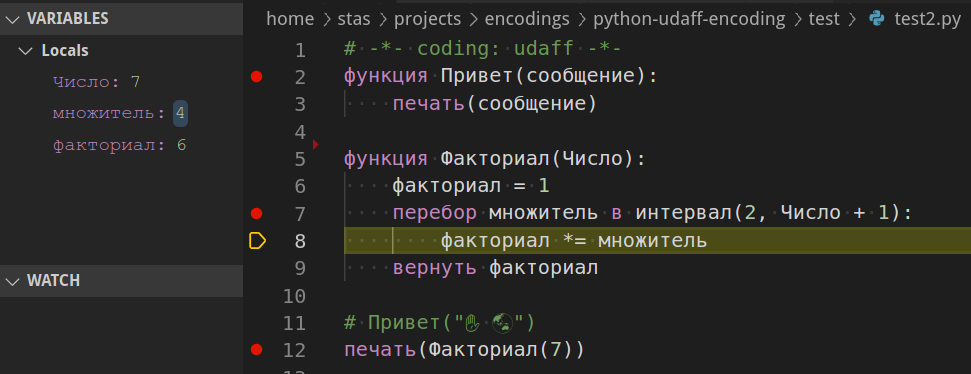

# Русификация Питона

## Проблема

В русскоязычном пространстве наблюдается странный эффект 
изобретения «русскоязычных» языков программирования,
и попыток навязать их обучающимся в Школе и ВУЗе

См. например [Кумир](http://0x1.tv/%D0%9A%D0%B0%D1%82%D0%B5%D0%B3%D0%BE%D1%80%D0%B8%D1%8F:%D0%9A%D1%83%D0%BC%D0%B8%D1%80), [SLang](http://0x1.tv/20190127E) (не путать с еще одной самоделкой — [СЛанг](http://0x1.tv/20171021CA))… множество их.

С одной стороны, вроде как основания есть — из-за специфики высшего образования в РФ (бесплатное образование, оплачивается ВУЗам МинОбром подушевым образом, отчислять невыгодно, и даже [запрещено](https://youtu.be/LDdgdKI20cU?t=1351)), в ВУЗы на околопрограммиские специальности попадает множество немотивированных
и функционально необразованных кадров, не способных понимать даже текст с десятком ключевых слов на английском. 
С другой стороны, возможно успех таких платформ типа 1C именно этим и обусловлен, да и есть немало энтузиастов, которые [считают, что русификация ЯП — полезна](http://www.0x1.tv/%D0%94%D0%B8%D0%B7%D0%B0%D0%B9%D0%BD_%D1%8F%D0%B7%D1%8B%D0%BA%D0%BE%D0%B2_%E2%80%94_%D0%9E%D0%9E%D0%9F_%D0%B8%D0%BB%D0%B8_%D0%BD%D0%B5_%D0%9E%D0%9E%D0%9F,_%D0%B8%D0%BB%D0%B8_%D0%BD%D0%B5%D1%87%D1%82%D0%BE_%D0%BB%D1%83%D1%87%D1%88%D0%B5_%D0%9E%D0%9E%D0%9F%3F_(%D0%90%D0%BB%D0%B5%D0%BA%D1%81%D0%B5%D0%B9_%D0%9D%D0%B5%D0%B4%D0%BE%D1%80%D1%8F,_ISPRASOPEN-2019)#comment-4763683278), и [учить на русифицированных языках эффективно](https://youtu.be/LDdgdKI20cU?t=1503).


Однако проблема всех этих самоделок в том, что язык — это не только синтаксис грамматики в BNF на полстраницы, а это инфраструктура:
* Редакторы, IDE, поддерживающие 100500 удобных фич, не говоря уже о обязательной «построчной» отладке.
    * Разработчики «Русских ЯП» пытаются делать некие подобия IDE, благо сейчас это можно слепить из каких-нибудь готовых компонентов (модуль текстового редактора с подсветкой, MDI интерфейс с менюшками) — но все что получается, это скажем прямо, уровень 90х, и сравнивая это с бесплатным и open-source «швейцарским ножем» Visual Studio Code, (не говоря уже о коммерческих IDE) хочеться только плакать от жалости.
* Инфраструктура пакетов (сами библиотеки, пакетные менеджеры), 100500 пакетов для решения всего скучного и типового, не говоря уже о нетривиальных платформах (быстрый вход в разработку игр, математические методы и AI и т.п.)
* Правильные концепции и парадигмы языка, проверенные десятилетиями обкатки на миллионном комьюнити профессионалов.
* Возможность получения профессиональных НАВЫКОВ, вшитых на уровень костного мозга, которых можно применить в профессиональной разработке для решения реальных проектов. Чтобы стартовав с элементарных алгоритмов и простых поделий, можно было эволюционировать в профессионала.


Но если «показать что-то про программирование на русском», на уровне «операторы-ветвление-цикл-функция-рекурсия» для совершенно левых людей (которым максимум в 1C в жизни придется что-то подправить) — допустимо, то совращать «девственно» чистых школьников кривыми поделиями, отрубая им прямой выход к реальной разработке и отбивая желание программировать («пробовал ваше программирование на К… » — ничего не работает, тормозит, криво, неудобно, долбайтесь сами), 
как минимум неэтично, хотя к сожалению, 
уголовно ненаказуемо.

Возникает дилемма — как бы убить двух зайцев — пользуясь одной платформой дать возможность 
[неодаренным и негодным студентам и школьникам](https://youtu.be/LDdgdKI20cU?t=1144) «попробовать программирование», а продвинутым, тут же, в том же классе, на том же софте, дать возможность уйти в отрыв и стать настоящими профессионалами.

## Решение

Итак, уже есть Python, идеальный язык для обучения, 
рожденный как язык для обучения, десятилетиями 
использующийся от везде — от уровня младших школьников,до профессионалов, как в программировании, так и в куче научных областей — будь то астрономия, биоинформатика, статистика… везде.

Знание его полезно, если не сказать необходимо, даже тем, кто не программист, если деятельность хоть как-то интеллектуальна (да, даже если экономист-юрист уровня выше чем «за рубль покупаем, за три продаем, на эти два процента и живем»).

К нему есть куча IDE, включая прекрасную поддержку даже в бесплатном и свободном Visual Studio Code (не нужно [изобретать страшные велосипеды](http://0x1.tv/20150124G)), есть 100500 пакетов, платформы для написания всего — игр, десктоп и вебприложений, даже мобильной и IOT  разработки… Впрочем, все это банально и очевидно.

Наша идея — добавить еще «маленькую лесенку» снизу, разрешив писать ключевые слова и базовые функции на русском, для тех, кто вот только стартует, не потеряв никаких возможностей Python.


Для этого можно воспользоваться идеей «пользовательских кодировок», перекодирующих файл с программным кодом при открытии. 
В результате, несколько десятков ключевых слов Python приводятся к каноническому английскому виду, их понимает и язык, и отладчики и т.п. 
А обучающийся имеет полную возможность, по мере изучения, постепенно заменить «русские аналоги» их оригинальными ключевыми словами, и с улыбкой (но без ненависти) забыть свои самые первые программы.



Лично я (Стас Фомин), не считаю, что это необходимо. На мой взгляд лучше таки выучить эти пару десятков ключевых слов Python на английском, и отсеять «электорат» с уровнем IQ меньше веса.  
Но идя путем «выбора меньшего зла» (_toss a coin to…_), я уверен, что этот подход лучше изобретения кривых велосипедов от скучающих преподавателей, которые будут калечить поколения школьников и студентов. Т.е. я был бы рад,
если все это не пригодилось при обучении, но при встрече с изобретателем очередного «национального языка», у меня будет куда его конструктивно послать.

С другой стороны, может это пригодится где-то, где Python используется как DSL для какой-нибудь бизнес-логики — короткие функции, которых должны править и вычитывать специалисты в предметной области, может это пригодится и там. 


Ну а название «udaff», отсылает к популярному времен начала Рунета ресурсу, который прекрасно иллюстрировал идею, что 
буквоедство и грамотность не так важны, как суть и контент, а иногда такое «грязное языковое хакерство», как кстати, в предложенном решении, даже весело.
Кстати, тут несложно сделать и поддержку разных версий «падонкоффского языга».

Более того, можно привлечь к программированию, совсем, так сказать, правополушарных людей, и использовать вместо идентификаторов функций и переменных значки emoji:

```python
# -*- coding: udaff -*-
функция 📢(✉️):
    печать(✉️)

📢("✋ 🌏")
```

(собственно идея и код взяты из проекта https://github.com/suda/python-emoji-encoding, спасибо его автору!)

## Использование

Поддерживается только 3 питон, ибо нет смысла поддерживать второй.

Ставится в систему
```
sudo pip3 install udaff-encoding
```

После инсталляции, ставьте первой (или второй, если первая _shebang_-строка) строчкой спецификатор кодировки:

```python
# -*- coding: udaff -*-
функция 📢(✉️):
    печать(✉️)

📢("✋ 🌏")
```

## Удаление (ужаса?)

Как обычный python-пакет, но возможно надо руками выкинуть `udaff.pth` из каталога `site-packages`.
Это конечно надо автоматизировать.

## Проблемка

Сейчас нельзя напрямую запустить или начать отлаживать файл с такой кодировкой.
Будет ругаццо:
```
SyntaxError: encoding problem: udaff
```

Пока есть воркараунт, сделать промежуточный файл-прокси, который включит как модуль нужный файл
```shell
$ cat proxy.py
import test2
```

Его уже можно чем угодно запускать и отлаживать.

Еще что-то как-то глючит под Anaconda в Windows, нет времени разбираться.

